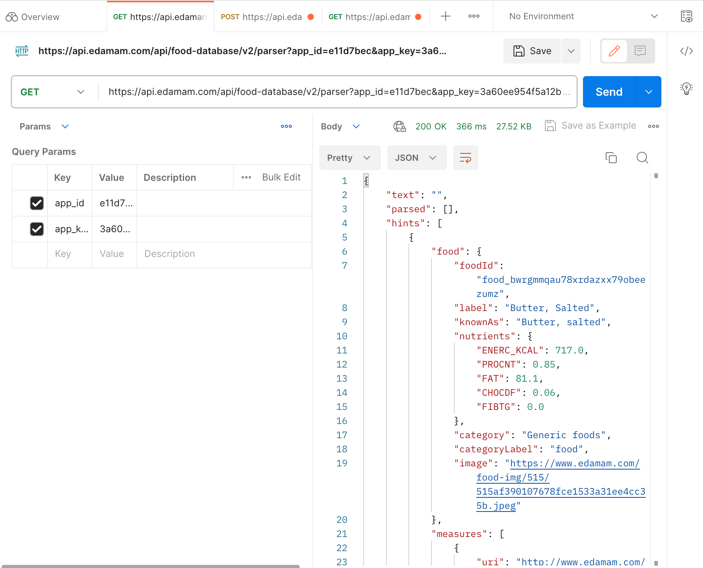

# NutriNinja

### Problem Domain:
Our project, which is tentatively called NutriNinja, is focused on Nutrition, specifically meal planning.

### High-Level Description of Application:
We are thinking of building an application that will generate custom meal suggestions based on user inputs. 
Users will make an account and then input their food preferences (e.g., vegetarian, keto), any dietary restrictions 
(e.g., gluten-free, nut allergy), and their macro-nutritional goals (e.g., high protein, low carb). In response, 
the system will output a curated list of meal ideas that meet the provided criteria. Additionally,
users can save their favorite meals and get ingredient lists and cooking instructions for each suggested meal.
For our project, we will use Edamam's Food Database API.

### Link to API
Here is a [link to the API documentation](https://developer.edamam.com/food-database-api-docs).

### Trying Out Edamam's API with Postman


### Calling the API from Java
See src/ApiCallExample.java for our sample API call using Java. We used ```OkHttp``` to make HTTP requests, and
```gson``` to parse JSON strings. The program makes a ```GET``` request to one of Edamam's endpoints, parses the body of
the response (which is formatted in JSON), and prints out the "labels" of each "food" item. The comments in the file 
provide more detail. Here is part of the output of our program (Note that we removed the "app_id" and "app_key" 
parameters in the URL):

```
Response{protocol=h2, code=200, message=, url=https://api.edamam.com/api/food-database/v2/parser?app_id=<...>&app_key=<...>5&calories=100-300}
"Cheese, Camembert"
"Cheese, Feta"
"Cheese, Mozzarella, Whole Milk"
"Cheese, Mozzarella, Part Skim Milk"
"Cheese, Mozzarella, Low Moisture, Part-Skim"
"Cheese, Neufchatel"
"Cheese, Ricotta, Whole Milk"
"Cheese, Ricotta, Part Skim Milk"
"Cheese Spread, Pasteurized Process, American"
"Cream, Fluid, Half and Half"
"Cream, Fluid, Light (Coffee Cream or Table Cream)"
"Cream, Fluid, Light Whipping"
```

### Technical Problems
We had some issues with pushing our changes to GitHub, and installing dependencies using Gradle. Specifically, we ran
into many merge conflicts which stemmed from tracking the .idea folder, and ApiCallExample could not resolve the 
dependencies despite them installing successfully. However, we were able to work through and fix these issues.
